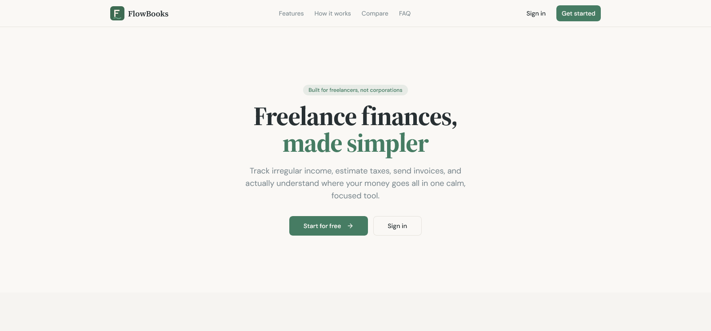

<div align="center">

  

# FlowBooks

**The all-in-one finance toolkit for freelancers — track income, manage expenses, create invoices, and estimate taxes.**

[](LICENSE)
[](https://typescriptlang.org)
[](https://reactjs.org)
[](https://supabase.com)
[](https://tailwindcss.com)
[](https://vitejs.dev)



</div>

---

FlowBooks is a freelance finance toolkit that consolidates income tracking, invoicing, expense management, and tax estimation into a single dashboard. Built for independent contractors and solo founders who need professional financial visibility without the complexity of enterprise accounting software.

---

## Features

- **Dashboard** — Overview with smoothed income tracking (3-month rolling average), expense breakdowns, and 6-month charts
- **Income Tracking** — Log payments, link to clients and projects, track payment status
- **Invoicing** — Create invoices with mark-as-paid that auto-generates income records
- **Expense Management** — Categorize expenses and monitor spending patterns
- **Client & Project CRM** — Manage contacts, track project budgets and statuses
- **Tax Estimator** — Quarterly tax estimates based on configurable saving percentages
- **Onboarding Wizard** — 3-step guided setup for country, income goals, and first client
- **Sortable Tables** — Click column headers to sort, filter any table with live search
- **CSV Export** — One-click data export on Income, Expenses, and Invoices pages
- **Authentication** — Email/password + Google OAuth with PKCE flow

---

## Tech Stack

| Category | Technology |
|---|---|
| Frontend | React 18 + TypeScript 5.8 (strict mode) |
| Build Tool | Vite 5.4 with SWC |
| Styling | Tailwind CSS v3 + Radix UI + shadcn/ui |
| Forms | React Hook Form 7 + Zod 3.25 + @hookform/resolvers |
| Data Fetching | TanStack Query v5 (useQuery + useMutation) |
| Table | @tanstack/react-table v8 (sorting, filtering) |
| Animation | Framer Motion |
| Backend/DB | Supabase (Auth + PostgreSQL + RLS) |
| Charts | Recharts |
| Routing | React Router v6 |
| Toasts | Sonner |
| Icons | Lucide React |
| CSV Export | Custom CSV utility (`src/lib/csv.ts`) |
| Testing | Vitest + Testing Library |
| Code Quality | ESLint 9 + TypeScript ESLint |

---

## Quick Start

### Prerequisites

- Node.js 18+
- pnpm (`npm install -g pnpm`)
- Supabase account

### Installation

```bash
# 1. Clone the repo
git clone https://github.com/MuhammadTanveerAbbas/flowbooks.git
cd flowbooks

# 2. Install dependencies
pnpm install

# 3. Set up environment variables
cp .env.example .env.local
# Fill in your Supabase credentials (see Environment Variables below)

# 4. Run schema against your Supabase project
# Go to Supabase Dashboard → SQL Editor → paste supabase/schema.sql → run

# 5. Run the development server
pnpm dev
```

Open [http://localhost:8080](http://localhost:8080) in your browser.

---

## Environment Variables

Create a `.env.local` file in the root directory:

```env
# Required - from Supabase Dashboard → Project Settings → API
VITE_SUPABASE_URL=https://your-project-ref.supabase.co
VITE_SUPABASE_PUBLISHABLE_KEY=your-supabase-anon-key
```

| Variable | Required | Description |
|---|---|---|
| `VITE_SUPABASE_URL` | Yes | Supabase project API URL |
| `VITE_SUPABASE_PUBLISHABLE_KEY` | Yes | Supabase anon/public key (safe in client) |
| `SUPABASE_URL` | For API functions | Supabase URL (server-side) |
| `SUPABASE_SERVICE_ROLE_KEY` | For API functions | Supabase service role key (server-side only) |
| `CRON_SECRET` | For API functions | Bearer token for /api/health and /api/keep-alive |
| `VITE_SUPABASE_PROJECT_ID` | For Supabase CLI | Project reference ID |

---

## Database Setup

Run the schema in `supabase/schema.sql` against your Supabase project. This creates 6 tables with Row Level Security enabled:

- **profiles** — User settings, tax preferences, onboarding status
- **clients** — Client contact information
- **projects** — Project tracking with budgets
- **invoices** — Invoice records with line items
- **income** — Income records linked to clients/projects/invoices
- **expenses** — Expense tracking with categories

---

## Project Structure

```
flowbooks/
├── api/                    # Vercel serverless functions (health, keep-alive)
├── public/                 # Static assets
├── src/
│   ├── components/
│   │   ├── layout/         # AppLayout, Sidebar, TopBar, MobileNav
│   │   ├── ui/             # shadcn/ui components (Radix-based)
│   │   ├── ErrorBoundary.tsx
│   │   ├── FlowBooksLogo.tsx
│   │   ├── PageLoader.tsx
│   │   └── ProtectedRoute.tsx
│   ├── hooks/
│   │   ├── AuthProvider.tsx # Auth context provider
│   │   ├── auth-context.ts  # Auth hook + context
│   │   ├── use-queries.ts  # TanStack Query hooks for data fetching
│   │   └── use-mutations.ts# TanStack Query mutation hooks for CRUD
│   ├── integrations/
│   │   └── supabase/       # Supabase client + generated types
│   ├── lib/
│   │   ├── csv.ts          # CSV export utility
│   │   ├── schemas.ts      # Zod schemas for forms
│   │   └── utils.ts        # cn() utility
│   ├── pages/              # 12 route-level page components
│   ├── test/               # Vitest setup + tests
│   ├── types/              # TypeScript type definitions
│   ├── App.tsx             # Root component with routing
│   ├── main.tsx            # App entry point
│   └── index.css           # Global styles + CSS variables
├── supabase/
│   ├── schema.sql          # Database schema with RLS policies
│   └── config.toml         # Supabase CLI config
├── .env.example            # Environment variable template
├── components.json         # shadcn/ui configuration
├── tailwind.config.ts      # Tailwind configuration
├── vite.config.ts          # Vite configuration with code splitting
├── vitest.config.ts        # Vitest configuration
└── package.json            # Dependencies & scripts
```

---

## Available Scripts

| Command | Description |
|---|---|
| `pnpm dev` | Start development server on port 8080 |
| `pnpm build` | Build for production |
| `pnpm preview` | Preview production build locally |
| `pnpm lint` | Run ESLint on all source files |
| `pnpm test` | Run tests |
| `pnpm test:watch` | Run tests in watch mode |

---

## Deployment (Vercel)

1. Push your repo to GitHub
2. Import project in Vercel
3. Add environment variables: `VITE_SUPABASE_URL`, `VITE_SUPABASE_PUBLISHABLE_KEY`
4. Deploy
5. Add your Vercel domain to Supabase Dashboard → Authentication → URL Configuration

If using cron (`/api/keep-alive`), the Vercel Pro plan is required.

---

## Legal

- [Privacy Policy](/privacy)
- [Terms of Service](/terms)
- [Refund Policy](/refund)

## License

Distributed under the MIT License. See `LICENSE` for more information.

---

## Built by The MVP Guy

<div align="center">

**Muhammad Tanveer Abbas**
SaaS Developer | Building production-ready MVPs in 14–21 days

[](https://themvpguy.vercel.app)
[](https://github.com/MuhammadTanveerAbbas)

_If this project helped you, please consider giving it a ⭐_

</div>
